<!-- Algunos de los usos más comunes de OpenSSL incluyen la creación y gestión de certificados digitales, la generación de claves criptográficas, la firma y verificación de datos, y la realización de pruebas de vulnerabilidad en sistemas y aplicaciones. -->
<!-- En resumen, los dominios ".local" son una forma conveniente de identificar dispositivos y servicios en una red local sin necesidad de configurar un servidor DNS externo. Sin embargo, es importante recordar que estos nombres solo son válidos y significativos dentro de la red local en la que se utilizan. -->
# Allow HTTPS protocol using OpenSSL library and Apache web server.
# Prerequisites:
* A web server (for example Apache) installed on your host.
* A domain name for your website: in this example i have used the domain: www.empresa-tarea-daw02.local
# Some of the most common uses for OpenSSL include creating and managing digital certificates, generating cryptographic keys, signing and verifying data, and performing vulnerability testing on systems and applications..
# In the folder we have our project that contains our index.html page, in this case it is the page that comes by default with apache2.
* Commands to install the openSSL package: 
**sudo apt update** 
**sudo apt upgrade** 
**sudo apt-get install openssl** 
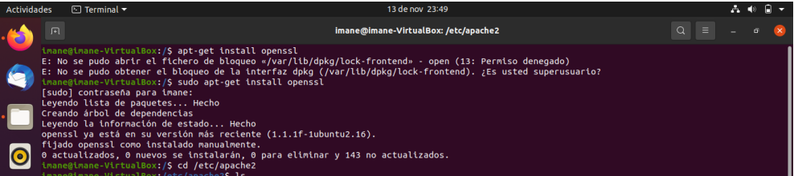 
* Crear un certificado autofirmado para el servidor web, para ello creamos carpeta donde guardar el certificado: 
**sudo mkdir /etc/apache2/tu-cert** 
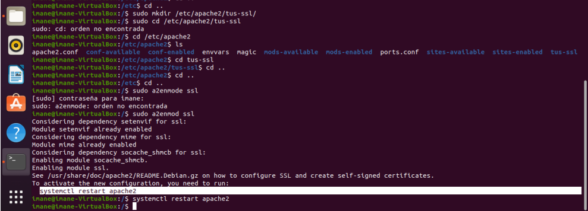  
## entramos al directorio: 
**cd /etc/apache2/tu-cert** 
## Enable the SSL Module: 
**sudo a2enmod ssl** 
## Test Configuration:
* Before restarting Apache, it's a good practice to test the configuration for syntax errors:
**sudo apachectl configtest**
## nos piderá el sistema reiniciar el servidor: 
**systemstl restart apache2** 
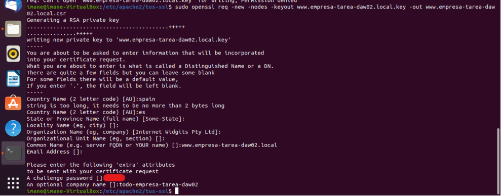  
## Update DNS Records:
* Ensure your domain's DNS records (CNAME or other) point to the correct IP address of your host.
## creamos el nuevo certificado: 
**sudo opessl req -new -nodes -keyout www.empresa-tarea-daw02.local.key -out www.empresa-tarea-daw02.local.csr**  
## se genera la clave privada del certificado(private key) 
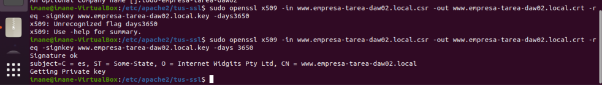  
## lo personalizamos y le signamos al certificado 10 años de validez 
**sudo openssl x509 -in www.empresa-tarea-daw02.local.csr -out www.empresa-tarea-daw02.local.crt -req -signkey www.empresa-tarea-daw02.local.key -days 3650** 
## si a pasado todo bien: en la firma sale el resultado ok(signature ok) 
## Update Server Configuration (Apache): todo-empresa-tarea-daw02-ssl.conf y activarlo: 
**sudo a2ensite todo-empresa-tarea-daw02-ssl.conf** </li>
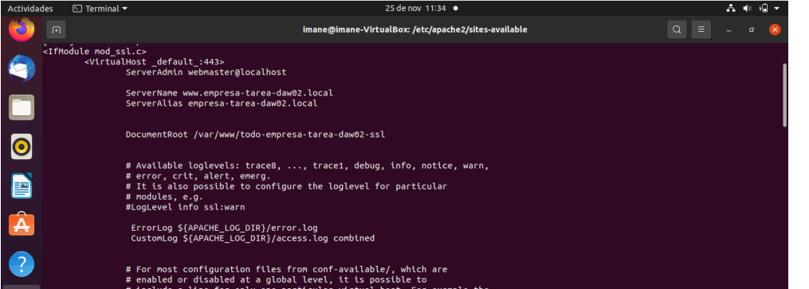  
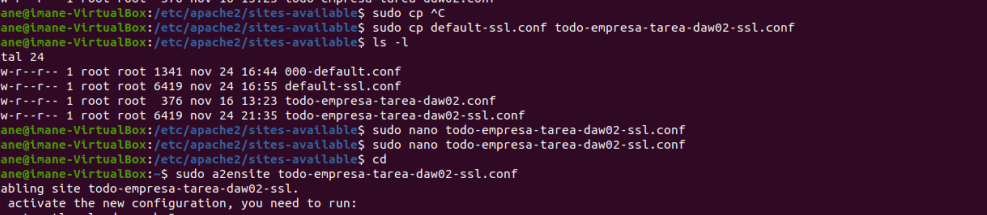  
**Comprobamos los datos del certificado en el navegador** 
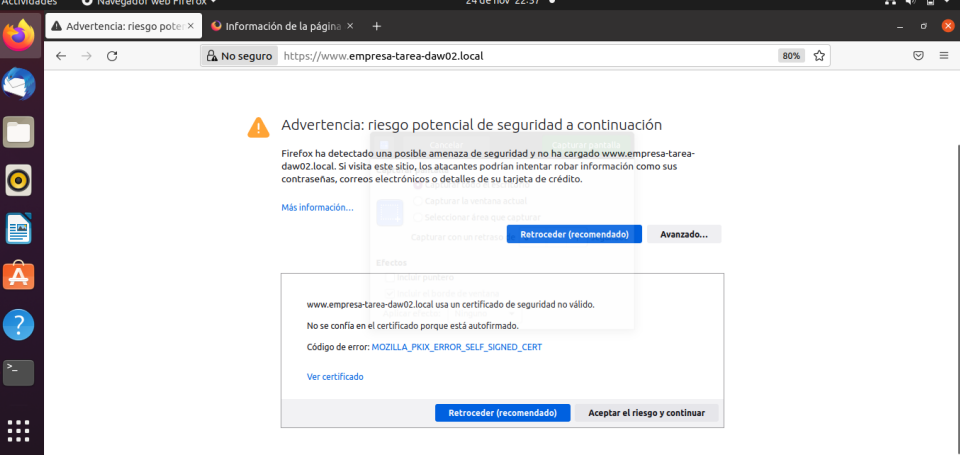  
* por defecto se nos cargará la página de apache insegura o sin el certificado ssl para ello hay que deshabilitar
el archivo 000-default para evitar que se cargue la página html de apache2 en nuestro
sitio, posteriormente crearé una página html para el nuevo sitio, es esta página que se cargará cuando llamamos a la página web: 
**sudo a2dissite 000-default.conf** 
**systemctl reload apache2** 
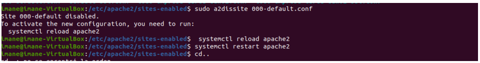  
## comprobamos accediendo con el protocolo https, el certificado es autofirmado, y no se ha reconocido del navegador porque no lo contiene en su listado de los certofocados reconocidos.Por eso muestra adverencia en la url 
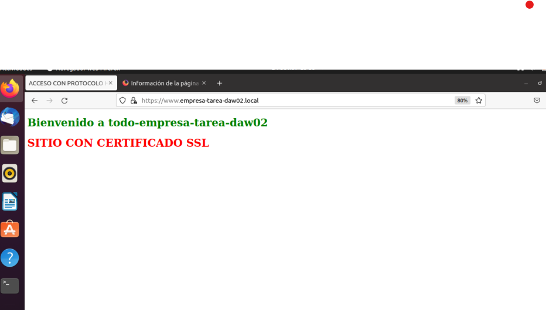  
## Podemos personalizar la página html para obtenerla por ejemplo así(imagen), el archivo html se encuentra en la carpeta #/var/www/todo-empresa-tarea-daw02 
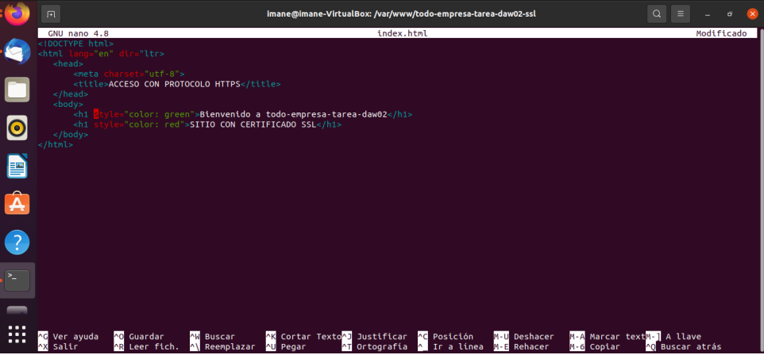  
## comprobamos administrador de certificados: 
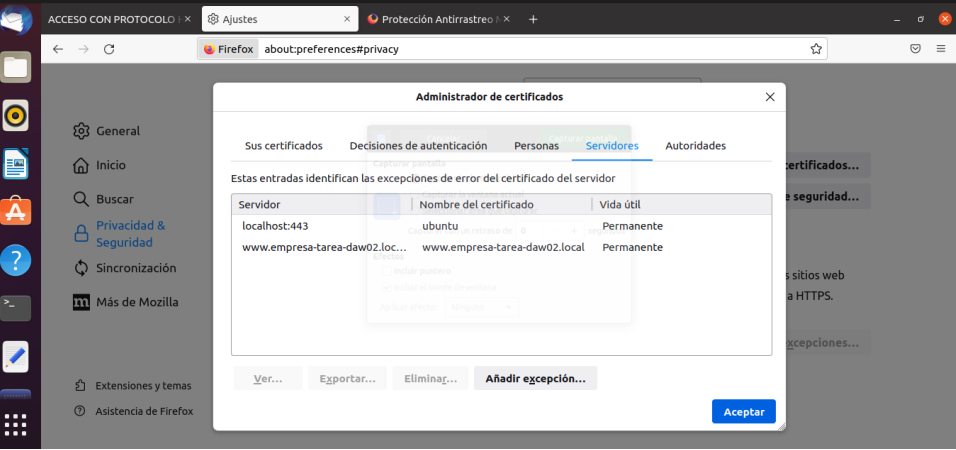  
## comprobamos puerto activado: 
**sudo netstat -tuln** 
  
   

